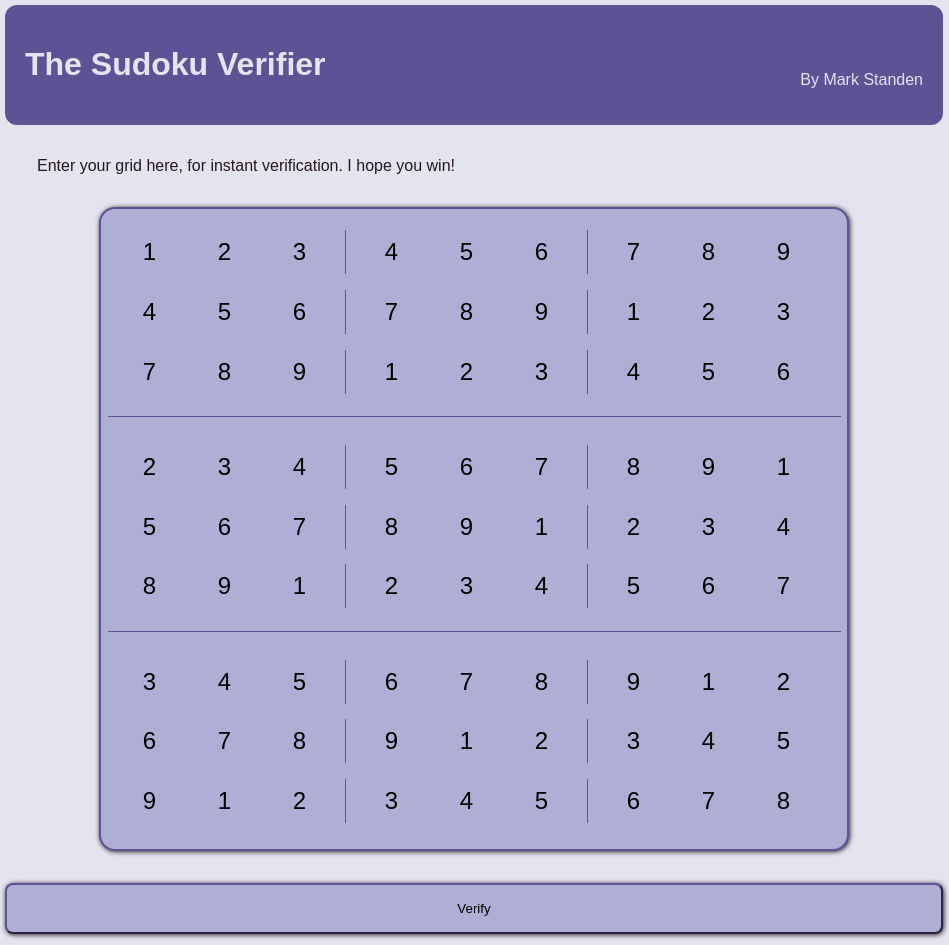

# sudoku-verifier

A mini project to verify a sudoku grid.

Now hosted on render! [sudoku-verifier](https://sudoku-verifier.onrender.com/)
There may be a delay of up to 30 seconds for the container to spin up... Please be patient.

## The Challenge

Given a valid grid and an invalid grid correctly identify the invalid grid by checking rows, columns and blocks.

A valid row, column and block contains 9 values - each of the values between 1-9 (inclusive) without duplication.

### Valid Sudoku Grid.

|     |     |     |     |     |     |     |     |     |
|:---:|:---:|:---:|:---:|:---:|:---:|:---:|:---:|:---:|
|  2  |  4  |  1  |  6  |  9  |  5  |  3  |  8  |  7  |
|  7  |  3  |  5  |  4  |  2  |  8  |  1  |  6  |  9  |
|  8  |  6  |  9  |  7  |  3  |  1  |  4  |  2  |  5  |
|  4  |  1  |  3  |  8  |  7  |  9  |  2  |  5  |  6  |
|  6  |  9  |  2  |  5  |  1  |  3  |  7  |  4  |  8  |
|  5  |  8  |  7  |  2  |  4  |  6  |  9  |  3  |  1  |
|  1  |  7  |  8  |  3  |  6  |  4  |  5  |  9  |  2  |
|  9  |  5  |  4  |  1  |  8  |  2  |  6  |  7  |  3  |
|  3  |  2  |  6  |  9  |  5  |  7  |  8  |  1  |  4  |

### Invalid Sudoku Grid.

|       |     |     |     |     |     |     |     |     |
|:-----:|:---:|:---:|:---:|:---:|:---:|:---:|:---:|:---:|
|   2   |  4  |  1  |  6  |  9  |  5  |  3  |  8  |  1  |
|   7   |  3  |  5  |  4  |  2  |  8  |  1  |  6  |  9  |
|   8   |  6  |  9  |  7  |  3  |  1  |  4  |  2  |  5  |
|   4   |  1  |  3  |  8  |  7  |  9  |  2  |  5  |  6  |
|   6   |  9  |  2  |  5  |  2  |  3  |  7  |  4  |  8  |
|   5   |  8  |  7  |  2  |  4  |  6  |  9  |  3  |  1  |
|   1   |  7  |  8  |  3  |  6  |  4  |  5  |  9  |  2  |
| **8** |  5  |  4  |  1  |  8  |  2  |  6  |  7  |  3  |
|   3   |  2  |  6  |  9  |  5  |  7  |  8  |  1  |  4  |

## Personal Challenges

### Streams API

I wanted to use the Java 8 functional streams API, and in particular to minimise declared loops.

I found this challenging as the grid is provided as an array, with the blocks being subgrids of the first.

As a compromise to myself I used parallel iterators to force non-sequential code. Although unlikely to be faster than
the traditional for loop method, readability of the declarative code is better.

### End-to-End testing

I wanted to write end-to-end tests with a limited public API to verify the app works as intended, rather than unit
testing individual methods. This was in part because the initial challenge was to write a single output to the console
stating whether the grid was valid, which means I'd need to create test grids for isolated tests.

- end-to-end test grids tailored to test individual private methods.

## Furthering the project

### Functional Programming

More and more of the functionality of the app was moved (and is continuing to move) to smaller static stateless
functions. These are highly reliable single use functions that can be heavily tested to ensure they work as expected,
with no side effects.

### Unit Testing

Further to the end-to-end testing of the original project, there are unit tests covering most of the functionality of
the app. The majority of these tests were written first, with edge cases and exception checks added as the method was
complete.

I find this a quick way to work, as it requires the functionality of the method to be thought through before starting to
code. U

### Generic Abstract Grid Superclass

Converting the Grid implementation to a Generic Abstract class could allow the grid to be used in future projects, and
presented many challenges due to the way Java handles generics and primitive values. Also, Array creation with Generics
throws a compiler error, so major refactoring was required.

### Servlet

Originally the verifier used the console as a means of communication, but I wrote a little servlet to send and receive
grids. This also allowed more practice at the following within Java:

- validating responses
- regular expressions
- string manipulation
- functional streams and lambdas

### Front End

It also provided an opportunity to exhibit:

- some creative use of forms
- css stying

## Future

### TODO

- [X] Java generated html
- [X] bookmarkable urls to store state
- [X] better response page
- [ ] testing server with test http requests
- [X] refactor for hidden grid implementation
- [X] dockerfile for easy deployment
- [X] Hosted!
